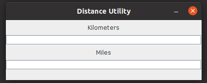
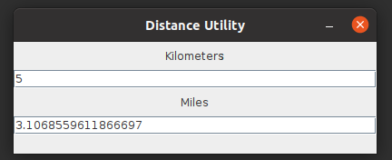
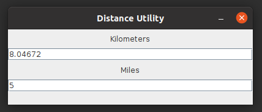

# Distance Utility
Have you ever wanted accurate conversion from miles to kilometers or vice-versa? Well you just hit the jackpot!
Distance Utility is a lightweight Java application which can convert kilometers to miles or miles to kilometers.

